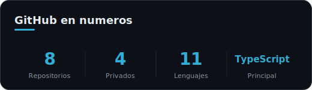
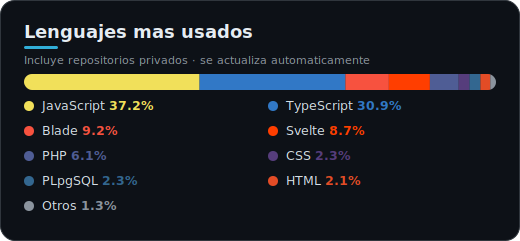

<h1 align="center">Anderson Coronado</h1>

  

&nbsp;&nbsp;

&nbsp;&nbsp;

&nbsp;&nbsp;

&nbsp;&nbsp;

 

## Sobre mí

Desarrollador de software enfocado en el desarrollo web full stack: construyo aplicaciones completas, desde la interfaz hasta la base de datos.

- Trabajo principalmente con **TypeScript, JavaScript, Svelte, Laravel y Node.js**.
- Modelo y consulto datos con **PostgreSQL**.
- Cuento también con experiencia en **C#**.
- Construyo productos útiles: gestión de proyectos, seguimiento de hábitos y herramientas de productividad.
- Aprendizaje constante, con foco en código limpio y mantenible.

 

## Tecnologías

**Lenguajes**

**Frameworks y entornos**

**Bases de datos**

**Herramientas**

 

## GitHub en números

 

## Lenguajes más usados

 

## Actividad

  

