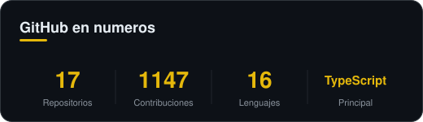
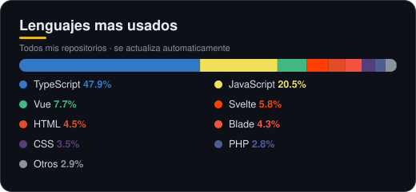

<h1 align="center">Anderson Coronado</h1>

  

&nbsp;&nbsp;

&nbsp;&nbsp;

&nbsp;&nbsp;

&nbsp;&nbsp;

 

## Sobre mí

Programo porque disfruto construir. Para mí el software es como una obra de arte: se piensa, se arma pieza por pieza y termina siendo útil para alguien. Trabajo full stack, así que me muevo igual de bien en el frontend y en el backend. Fuera del código dibujo, pinto, esculpo y juego videojuegos — al final se trata de lo mismo: **crear algo que antes no existía**.

 

## Tecnologías

Pasa el cursor sobre cada icono para ver su nombre.

**Lenguajes**

**Frontend**

**Backend**

**Bases de datos**

**Herramientas**

 

## Proyectos destacados

| Proyecto | Qué es | Stack |
| --- | --- | --- |
| **[Acmsy](https://acmsy.com)** | Panel de escritorio para administrar un servidor completo: contenedores, métricas en vivo y despliegues. | Electron · React · Express · Docker |
| **[Drestyl](https://drestyl.acmsy.com)** | Registra tu clóset y cada mañana te sugiere un outfit con IA según el clima y tu día. | Next.js · React · PostgreSQL · IA |
| **[Splitmate](https://splitmate.acmsy.com)** | Gastos compartidos del hogar: quién puso qué y cómo se salda la cuenta. | SvelteKit · TypeScript · PostgreSQL |
| **[Grabber](https://grabber.acmsy.com)** | Gestor de descargas con biblioteca, colas en vivo, papelera y doble factor. | Fastify · Prisma · SQL Server |
| **[Vexcel](https://vexcel.acmsy.com)** | Conversor de archivos con cuentas, equipos, biblioteca y planes de suscripción. | Angular · Express · MongoDB |
| **[Subwise](https://subwise.acmsy.com)** | Control de suscripciones: qué pagas, cuánto suma al mes y cuándo toca cada cobro. | Vue 3 · Nuxt · MySQL |

 

## Experiencia

**Desarrollador Full Stack** — Hospital San Vicente Fundación · Nov 2025 – May 2026
Sistemas internos (Cargue de Insumos de Cirugía, PROA, Oncología) con PHP, JavaScript, Python, SQL Server, MySQL, React y Node. Mejoras de arquitectura y seguridad, una herramienta de gestión de proyectos, e integraciones con SAP.

**Desarrollador Full Stack — Practicante** — Hospital San Vicente Fundación · Mar – Sep 2025
Desarrollo a medida para los procesos del hospital: manejo GS1 de insumos, programación de cirugías, recepción de medicamentos, PROA y PIM3.

 

## Formación

- **Ingeniería en Sistemas** — Institución Universitaria ITM · 2026 – actualidad
- **Tecnología en Desarrollo de Software** — Institución Universitaria ITM · 2023 – 2026

 

## GitHub en números

 

## Lenguajes más usados

 

## Actividad

